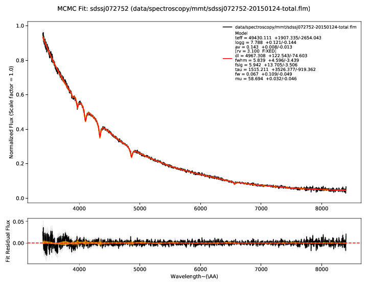
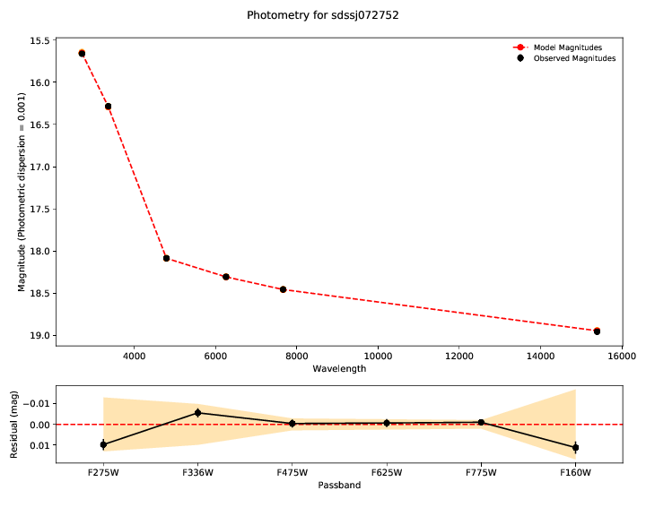
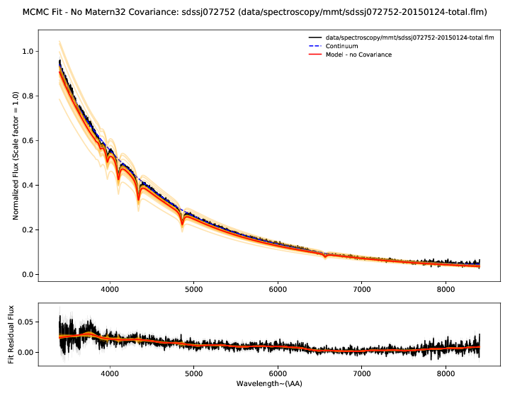
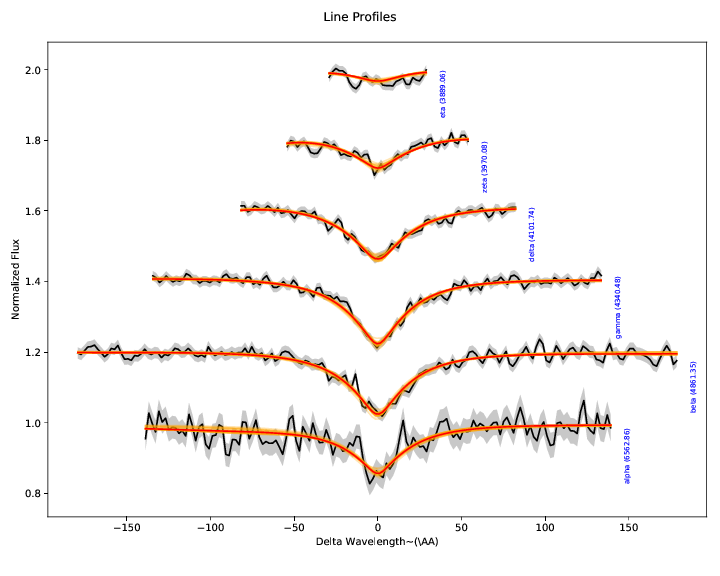
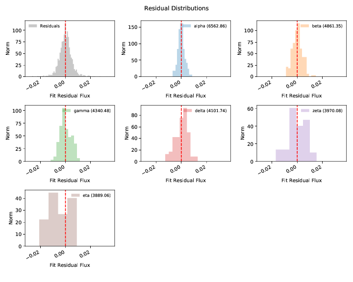
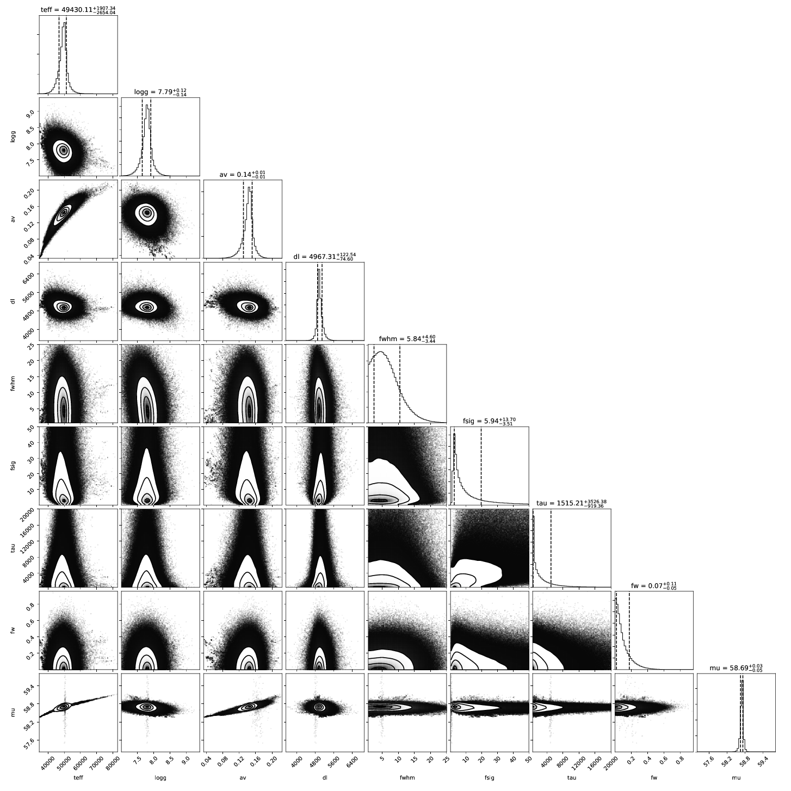

Analyzing WDmodel
-----------------
.. highlight:: guess

This document describes the output produced by the ``WDmodel`` package.

.. toctree::
   :maxdepth: 3

* :ref:`Analysis <analysis>`
   - :ref:`The fit  <fit>`
   - :ref:`Spectral flux calibration errors  <spec_nogp>`
   - :ref:`Hydrogen Balmer line diagnostics <balmer>`
   - :ref:`Posterior distributions <posterior>`
   - :ref:`Output files <output>`

.. _analysis:

========
Analysis
========

There's many different outputs (ascii files, bintables, plots) that are
produced by the ``WDmodel`` package. We'll describe the plots first - it is a
good idea to look at your data before using numbers from the analysis.

.. _fit:

1. The fit:
~~~~~~~~~~~

All the plots are stored in ``<spec basename>_mcmc.pdf`` in the output
directory that is printed as you run the ``WDmodel`` fitter (default:
``out/<object name>/<spec basename>/``.

The first plots show you the bottom line - the fit of the model (red) to the
data - the observed photometry and spectroscopy (black). Residuals for both are
shown in the lower panel. The model parameters inferred from the data are shown
in the legend of the spectrum plot. Draws from the posterior are shown in
orange. The number of these is customizable with ``--ndraws``. Observational
uncertainties are shown as shaded grey regions.

If both of these don't look reasonable, then the inferred parameters are
probably meaningless. You should look at why the model is not in good agreement
with the data. We've found this tends to happen if there's a significant flux
excess at some wavelengths, indicating a companion or perhaps variability.

.. _spec_nogp:

2. Spectral flux calibration errors:
~~~~~~~~~~~~~~~~~~~~~~~~~~~~~~~~~~~~

The ``WDmodel`` package uses a Gaussian process to model correlated flux
calibration errors in the spectrum. These arise from a variety of sources
(flat-fielding, background subtraction, extraction of the 2D spectrum with a
polynomial, telluric feature removal, and flux calibration relative to some
other spectrophotometric standard, which in turn is probably only good to a few
percent). However, most of the processes that generate these errors would cause
smooth and continuous deformations to the observed spectrum, and a single
stationary covariance kernel is a useful and reasonable way to model the
effects. The choice of kernel is customizable (``--covtype``, with default
``Matern32`` which has proven more than sufficient for data from four different
spectrographs with very different optical designs).

The residual plot shows the difference between the spectrum and best fit model
without the Gaussian process applied. The residuals therefore show our estimate
of the flux calibration errors and the Gaussian process model for them.

.. _balmer:

3. Hydrogen Balmer line diagnostics:
~~~~~~~~~~~~~~~~~~~~~~~~~~~~~~~~~~~~

These plots illustrate the spectroscopic data and model specifically in the
region of the Hydrogen Balmer lines. While the entire spectrum and all the
photometry is fit simultaneously, we extract the Balmer lines, normalize their
local continua to unity, and illustrate them separately here, offsetting each
vertically a small amount for clarity.

With the exception of the SDSS ``autofit`` package used for their white dwarf
analysis (which isn't public in any case), every white dwarf atmosphere fitting
code takes the approach of only fitting the Hydrogen Balmer lines to determine
model parameters. This includes our own proof-of-concept analysis of Cycle 20
data. The argument goes that the inferred model parameters aren't sensitive to
reddening if the local continuum is divided out, and the line profiles
determine the temperature and surface gravity.

In reality, reddening also changes the shape of the line profiles, and to
divide out the local continuum, a model for it had to be fit (typically a
straight line across the line from regions defined "outside" the line profile
wings). The properties of this local continuum *are* strongly correlated with
reddening, and errors in the local continuum affect the inference of the model
parameters, particularly at low S/N. This is the regime our program to observe
faint white dwarfs operates in - low S/N with higher reddening. Any reasonable
analysis of systematic errors should illustrate significant bias resulting from
the naive analysis in the presence of correlated errors.

In other words, the approach doesn't avoid the problem, so much as shove it
under a rug with the words "nuisance parameters" on top.  This is why we
adopted the more complex forward modeling approach in the ``WDmodel`` package.
Unfortunately, Balmer profile fits are customary in the field, so after we
forward model the data, we make a simple polynomial fit to the continuum (using
our best understanding of what SDSS' ``autofit`` does), and extract out the
Balmer lines purely for this visualization. This way the polynomial continuum
model does have no affect on the inference, and if it goes wrong and the Balmer
line profile plots look wonky, it doesn't actually matter.

If you mail the author about these plots, he will get annoyed and grumble about
you, and probably reply with snark. He had no particular desire to even include
these plots.

.. _posterior:

4. Posterior Distributions:
~~~~~~~~~~~~~~~~~~~~~~~~~~~

A corner plot of the posterior distribution. If the model and data are not in
good agreement, then this is a good place to look. If you are running with
``--samptype=ensemble`` (the default), you might consider ``--samptype=pt
--ntemps=5 --nwalkers=100 --nprod=5000 --thin 10`` to better sample the
posterior, and map out any multi-modality.

.. _output:

5. Output Files:
~~~~~~~~~~~~~~~~

This table describes the output files produced by the fitter.

=================================== =======================================================================
File                                Description
=================================== =======================================================================
``<spec basename>_inputs.hdf5``     All inputs to fitter and visualization module. Restored on ``--resume``
``<spec basename>_params.json``     Initial guess parameters. Refined by minuit if not ``--skipminuit``
``<spec basename>_minuit.pdf``      Plot of initial guess model, if refined by minuit
``<spec basename>_mcmc.hdf5``       Full Markov Chain - positions, log posterior, chain attributes
``<spec basename>_mcmc.pdf``        Plot of model and data after MCMC
``<spec basename>_result.json``     Summary of inferred model parameters, errors, uncertainties after MCMC
``<spec basename>_spec_model.dat``  Table of the observed spectrum and inferred model spectrum 
``<spec basename>_phot_model.dat``  Table of the observed photometry and inferred model photometry
``<spec basename>_full_model.hdf5`` Derived normalized SED of the object
=================================== =======================================================================

See :ref:`extraroutines` for some useful routines to summarize fit results.

